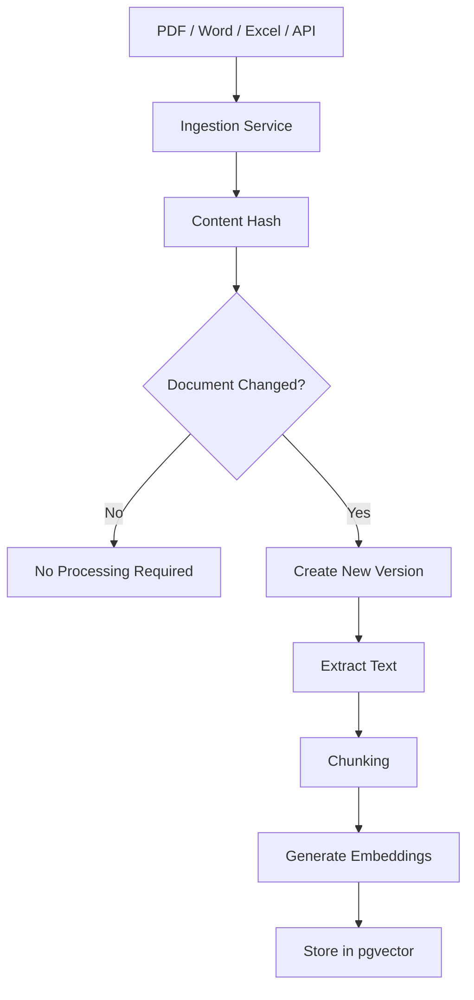

# PetroKnowledge AI — System Architecture

---

# 1. Purpose

This document describes the high-level architecture of PetroKnowledge AI.

The goal of the architecture is to support secure enterprise knowledge retrieval, structured operational data access, AI-assisted reasoning, auditability, and future integrations with enterprise systems.

The architecture is intentionally modular so that individual components can evolve or be replaced without redesigning the entire platform.

---

# 2. Architecture Goals

PetroKnowledge AI is designed around the following architecture goals:

- Secure access to enterprise information
- Clear separation between structured and unstructured data
- Modular AI services
- Multi-tenant support
- Department-level authorization
- Document versioning and traceability
- Real-time or near-real-time operational data access
- Auditable AI responses
- Scalable enterprise integrations
- Cloud-ready deployment

---

# 3. High-Level Architecture

PetroKnowledge AI is divided into five main layers:

1. Experience Layer
2. Application Layer
3. Knowledge & Data Layer
4. AI Intelligence Layer
5. Governance & Observability Layer

```mermaid
flowchart TD

    U[Employee / User]

    U --> UI[Web Application]

    UI --> API[FastAPI Backend]

    API --> AUTH[Authentication & Authorization]
    API --> ROUTER[Knowledge Router]
    API --> AUDIT[Audit Service]

    ROUTER --> DOCS[Document Intelligence]
    ROUTER --> DATA[Structured Data Intelligence]

    DOCS --> VECTOR[PostgreSQL + pgvector]
    DATA --> DB[PostgreSQL / Enterprise Data Sources]

    VECTOR --> CONTEXT[Context Builder]
    DB --> CONTEXT

    CONTEXT --> LLM[Large Language Model]

    LLM --> RESPONSE[Grounded Response]

    RESPONSE --> UI
    RESPONSE --> AUDIT
````

---

# 4. Experience Layer

The Experience Layer represents the interfaces used by employees.

Initial interfaces may include:

* Web application
* Internal enterprise portal

Future interfaces may include:

* Mobile applications
* Microsoft Teams
* Slack
* Enterprise CRM interfaces
* Internal business applications

The Experience Layer does not directly access enterprise databases or AI models.

All requests must pass through the backend application layer.

---

# 5. Application Layer

The Application Layer contains the core business logic of PetroKnowledge AI.

The initial backend will be implemented using:

* Python
* FastAPI

Main responsibilities include:

* Request validation
* Authentication
* Authorization
* Query routing
* Business logic
* AI orchestration
* Integration management
* Audit logging

The backend acts as the controlled entry point to the platform.

---

# 6. Authentication and Authorization

Authentication determines:

> Who is the user?

Authorization determines:

> What information is the user allowed to access?

PetroKnowledge AI will initially use:

* Supabase Auth
* PostgreSQL Row-Level Security
* Organization membership
* Department membership
* Role-based permissions

Security filtering must occur before enterprise information is sent to the AI model.

Example:

```text
User Question

↓

Authenticate User

↓

Identify Organization

↓

Identify Department and Roles

↓

Apply Access Rules

↓

Retrieve Authorized Information
```

---

# 7. Knowledge Router

Not every question should be processed using the same strategy.

The Knowledge Router determines the most appropriate source of information.

Examples:

### Document Question

User asks:

"Who can approve a payment above ARS 50 million?"

Route:

```text
Question
→ Document Retrieval
→ RAG
```

### Structured Data Question

User asks:

"How many invoices are pending payment today?"

Route:

```text
Question
→ Structured Data
→ SQL / API
```

### Hybrid Question

User asks:

"Which invoices require manager approval and why?"

Route:

```text
Question
       │
       ▼
Knowledge Router
     /     \
    /       \
SQL Data    RAG
    \       /
     \     /
 Context Builder
       │
       ▼
      LLM
```

The Knowledge Router prevents the platform from treating every business question as a document search problem.

---

# 8. Knowledge & Data Layer

PetroKnowledge AI works with two primary categories of enterprise information.

## 8.1 Unstructured Knowledge

Examples:

* PDF files
* Policies
* Procedures
* Contracts
* Manuals
* Regulations
* Word documents

These sources will be processed using:

* Metadata
* Versioning
* Chunking
* Embeddings
* Vector search

---

## 8.2 Structured Operational Data

Examples:

* Invoices
* Vendors
* Purchase orders
* Payments
* ERP transactions
* CRM records
* Financial metrics

Structured data should be queried directly using databases or APIs instead of converting everything into embeddings.

Examples of future data sources include:

* PostgreSQL
* BigQuery
* SAP
* SQL Server
* Oracle
* CRM systems

---

# 9. Document Intelligence Architecture

Enterprise documents follow a dedicated ingestion pipeline.



The ingestion pipeline is separate from the user query pipeline.

This allows documents to be processed asynchronously without affecting user interactions.

---

# 10. Document Versioning

Documents must preserve historical versions.

Example:

```text
Payment Approval Policy

Version 1.0
Version 1.1
Version 2.0 ← Active
```

Previous versions are preserved for:

* Audit purposes
* Compliance
* Historical questions
* Change tracking

Each document version may generate its own set of chunks and embeddings.

---

# 11. Operational Data Synchronization

Operational information changes more frequently than enterprise documents.

Examples include:

* New invoices
* Payment status
* Purchase orders
* ERP transactions

These records may be synchronized using:

### Event-Driven Integration

```text
Enterprise System
→ Event
→ PetroKnowledge API
→ Database Update
```

### Scheduled Synchronization

```text
Scheduler
→ Source System
→ Detect New Records
→ Update PetroKnowledge
```

### On-Demand Retrieval

```text
User Question
→ External API
→ Current Status
```

The source enterprise system remains the System of Record.

PetroKnowledge AI provides an intelligent access layer rather than replacing the operational system.

---

# 12. Context Builder

The Context Builder prepares the information that will be sent to the Large Language Model.

The LLM should never receive unrestricted access to enterprise systems.

Instead, PetroKnowledge AI retrieves only the information required to answer the user's question.

Example:

```text
Question:

"Which invoices require manager approval?"

Structured Data:

Invoice 1001
Amount: ARS 75,000,000

Invoice 1002
Amount: ARS 12,000,000

Policy Context:

Payments above ARS 50,000,000 require manager approval.
```

The Context Builder combines authorized information into a controlled prompt context.

---

# 13. AI Intelligence Layer

The AI Intelligence Layer will include multiple services.

Initial capabilities include:

* Embedding generation
* Semantic search
* Retrieval-Augmented Generation
* Context construction
* LLM response generation

Future capabilities may include:

* Hybrid search
* Reranking
* Query rewriting
* Multi-model routing
* AI agents
* Automated evaluation
* Guardrails

The AI layer must remain independent from the selected model provider.

This allows the platform to use providers such as:

* OpenAI
* Amazon Bedrock
* Google Gemini
* Anthropic Claude

without redesigning the core platform.

---

# 14. Governance and Auditability

Enterprise AI requires complete traceability.

PetroKnowledge AI will record important events such as:

* User authentication
* Document uploads
* Document updates
* Version changes
* User questions
* Retrieved sources
* AI responses
* Model usage
* Integration failures
* Security-sensitive actions

Example audit record:

```text
User: analyst@company.com
Organization: Patagonia Energy
Department: Finance
Action: ASK_QUESTION
Question: Which invoices require approval?
Sources Used: 4
Timestamp: 2026-08-07T15:00:00Z
```

---

# 15. Current Technology Architecture

Initial implementation:

| Component               | Technology                                      |
| ----------------------- | ----------------------------------------------- |
| Backend                 | Python + FastAPI                                |
| Database                | PostgreSQL                                      |
| Platform                | Supabase                                        |
| Authentication          | Supabase Auth                                   |
| Authorization           | PostgreSQL RLS                                  |
| Vector Storage          | pgvector                                        |
| Document Storage        | Supabase Storage                                |
| Version Control         | Git + GitHub                                    |
| Development Environment | Visual Studio Code                              |
| Containerization        | Docker                                          |
| AI Orchestration        | Custom Python services / LangChain where useful |

---

# 16. Future AWS Architecture

The initial platform will be designed so that components can later be deployed using AWS services.

Possible future mapping:

| Current Component | AWS Option                     |
| ----------------- | ------------------------------ |
| File Storage      | Amazon S3                      |
| AI Models         | Amazon Bedrock                 |
| Backend Compute   | AWS Lambda / ECS               |
| API Layer         | Amazon API Gateway             |
| Authentication    | Amazon Cognito                 |
| Secrets           | AWS Secrets Manager            |
| Monitoring        | Amazon CloudWatch              |
| Database          | Amazon RDS / Aurora PostgreSQL |
| Search            | pgvector / Amazon OpenSearch   |
| Infrastructure    | Terraform                      |

The migration to AWS should not require redesigning the business logic of the platform.

---

# 17. Architecture Principle

PetroKnowledge AI follows one central architectural rule:

> Retrieve only what the user is authorized to access, build only the context required for the question, and send only that controlled context to the AI model.

This principle supports security, privacy, cost efficiency, and explainability.

